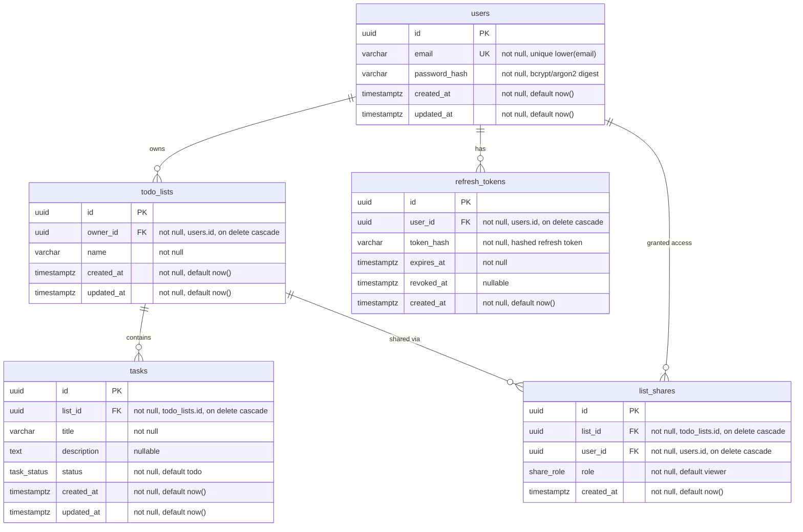

# TODO LIST API

## FUNCTIONALITY

- User authorization & authentication
- Create, rename, delete todo-lists
- Create, edit, delete, update status for tasks in todo-lists
- Share access to todo-lists by email (view only)

## STACK

- Typescript
- NestJS
- PostgreSQL
- Drizzle ORM & Drizzle kit
- Jest

## API CONTRACTS

### Conventions

- Base path: `/api/v1`
- All request/response bodies are `application/json`.
- Authentication: `Authorization: Bearer <accessToken>` (JWT). Required on every endpoint except `POST /auth/register` and `POST /auth/login`.
- Timestamps are ISO 8601 UTC strings (e.g. `2026-07-29T10:44:00.000Z`).
- IDs are UUID v4 strings.
- Validation errors return `400`; missing/invalid token `401`; authenticated-but-not-allowed `403`; unknown resource `404`; conflicts (e.g. duplicate email) `409`.

### Frontend integration

- Local dev base URL: `http://localhost:{PORT}/api/v1` (`PORT` defaults to `3000`).
- Swagger UI: `http://localhost:{PORT}/docs` — note this is outside the `/api/v1` prefix.
- CORS: set `CORS_ORIGIN` (comma-separated list of allowed origins) to the frontend's origin(s). Unset means no cross-origin browser request is allowed — there is no permissive/wildcard fallback.
- Auth tokens are returned in the JSON response body (`accessToken`, `refreshToken`), not cookies. The frontend stores them client-side and sends `Authorization: Bearer <accessToken>` — no credentialed requests (`credentials: 'include'`) needed.
- `GET /api/v1/health` returns `{ "status": "ok" }` with no auth required — useful as a connectivity smoke test.

### Standard error shape

```json
{
  "statusCode": 400,
  "message": ["email must be an email"],
  "error": "Bad Request"
}
```

### Roles / access model

- **Owner** — the user who created the list. Full read/write on the list, its tasks, and its shares.
- **Viewer** — a user the list was shared with by email. Read-only on the list and its tasks. Cannot edit tasks, cannot manage shares.

---

### Auth

#### `POST /auth/register`

Create a new user account. Public.

Request:

```json
{
  "email": "user@example.com",
  "password": "P@ssw0rd123"
}
```

`201 Created`:

```json
{
  "user": {
    "id": "uuid",
    "email": "user@example.com",
    "createdAt": "2026-07-29T10:44:00.000Z"
  },
  "accessToken": "jwt",
  "refreshToken": "jwt"
}
```

Errors: `400` invalid body, `409` email already registered.

#### `POST /auth/login`

Authenticate and receive tokens. Public.

Request:

```json
{ "email": "user@example.com", "password": "P@ssw0rd123" }
```

`200 OK`:

```json
{ "accessToken": "jwt", "refreshToken": "jwt" }
```

Errors: `400` invalid body, `401` invalid credentials.

#### `POST /auth/refresh`

Exchange a valid refresh token for a new token pair.

Request:

```json
{ "refreshToken": "jwt" }
```

`200 OK`:

```json
{ "accessToken": "jwt", "refreshToken": "jwt" }
```

Errors: `401` invalid/expired refresh token.

#### `POST /auth/logout`

Invalidate the caller's refresh token. Requires auth.

`204 No Content`.

#### `GET /auth/me`

Return the authenticated user. Requires auth.

`200 OK`:

```json
{
  "id": "uuid",
  "email": "user@example.com",
  "createdAt": "2026-07-29T10:44:00.000Z"
}
```

---

### Todo-lists

Resource:

```json
{
  "id": "uuid",
  "name": "Groceries",
  "ownerId": "uuid",
  "role": "owner",
  "createdAt": "2026-07-29T10:44:00.000Z",
  "updatedAt": "2026-07-29T10:44:00.000Z"
}
```

`role` is the caller's relationship to the list: `"owner"` or `"viewer"`.

#### `POST /lists`

Create a todo-list owned by the caller.

Request:

```json
{ "name": "Groceries" }
```

`201 Created` → list resource. Errors: `400` invalid name.

#### `GET /lists`

List all todo-lists the caller owns or has been granted view access to.

Query params (optional): `role=owner|viewer` to filter.

`200 OK`:

```json
{
  "data": [
    /* list resources */
  ]
}
```

#### `GET /lists/:listId`

Get a single list. Owner or viewer.

`200 OK` → list resource. Errors: `403` no access, `404` not found.

#### `PATCH /lists/:listId`

Rename a list. Owner only.

Request:

```json
{ "name": "Weekly groceries" }
```

`200 OK` → updated list resource. Errors: `400`, `403` viewer, `404`.

#### `DELETE /lists/:listId`

Delete a list and cascade its tasks and shares. Owner only.

`204 No Content`. Errors: `403` viewer, `404`.

---

### Tasks

Tasks are nested under a list. Status is an enum: `todo`, `in_progress`, `done`.

Resource:

```json
{
  "id": "uuid",
  "listId": "uuid",
  "title": "Buy milk",
  "description": "2 liters, whole",
  "status": "todo",
  "createdAt": "2026-07-29T10:44:00.000Z",
  "updatedAt": "2026-07-29T10:44:00.000Z"
}
```

#### `POST /lists/:listId/tasks`

Create a task in the list. Owner only.

Request:

```json
{ "title": "Buy milk", "description": "2 liters, whole" }
```

`description` is optional. New tasks default to `status: "todo"`.

`201 Created` → task resource. Errors: `400`, `403` viewer, `404` list not found.

#### `GET /lists/:listId/tasks`

List tasks in the list. Owner or viewer.

Query params (optional): `status=todo|in_progress|done`.

`200 OK`:

```json
{
  "data": [
    /* task resources */
  ]
}
```

Errors: `403` no access, `404`.

#### `GET /lists/:listId/tasks/:taskId`

Get a single task. Owner or viewer.

`200 OK` → task resource. Errors: `403`, `404`.

#### `PATCH /lists/:listId/tasks/:taskId`

Edit a task's title and/or description. Owner only.

Request (any subset):

```json
{ "title": "Buy oat milk", "description": "1 liter" }
```

`200 OK` → updated task resource. Errors: `400`, `403` viewer, `404`.

#### `PATCH /lists/:listId/tasks/:taskId/status`

Update task status. Owner only.

Request:

```json
{ "status": "done" }
```

`200 OK` → updated task resource. Errors: `400` invalid status, `403` viewer, `404`.

#### `DELETE /lists/:listId/tasks/:taskId`

Delete a task. Owner only.

`204 No Content`. Errors: `403` viewer, `404`.

---

### Sharing (view-only)

An owner grants another user read access to a list by email. The target user must already have an account.

Share resource:

```json
{
  "id": "uuid",
  "listId": "uuid",
  "userId": "uuid",
  "email": "viewer@example.com",
  "createdAt": "2026-07-29T10:44:00.000Z"
}
```

#### `POST /lists/:listId/shares`

Share a list with a user by email (view only). Owner only.

Request:

```json
{ "email": "viewer@example.com" }
```

`201 Created` → share resource.

Errors: `400` invalid email, `403` not owner, `404` list or target user not found, `409` already shared, `422` cannot share with self.

#### `GET /lists/:listId/shares`

List everyone the list is shared with. Owner only.

`200 OK`:

```json
{
  "data": [
    /* share resources */
  ]
}
```

Errors: `403` not owner, `404`.

#### `DELETE /lists/:listId/shares/:userId`

Revoke a user's access. Owner only.

`204 No Content`. Errors: `403` not owner, `404` list or share not found.

---

## DATABASE SCHEMA

PostgreSQL via Drizzle ORM. Five tables and two enums.

### Entity–relationship diagram



### Enums

```sql
CREATE TYPE task_status AS ENUM ('todo', 'in_progress', 'done');
CREATE TYPE share_role  AS ENUM ('viewer', 'editor');
```

### Access model

Access to a list is the union of ownership and shares:

- **Owner** — `todo_lists.owner_id = userId`. Full read/write on the list, its tasks, and its shares.
- **Share `role = 'viewer'`** — read-only on the list and its tasks.
- **Share `role = 'editor'`** — read on the list, read/write on its tasks. *(Reserved for future edit-sharing; the current API only creates `viewer` shares.)*

The `role` column lets edit-sharing ship later without a schema migration: add `role` to the `POST /lists/:listId/shares` body and relax the task write guard to accept `editor`.

### Table notes

- **`users`** — store email lowercased (unique index on `lower(email)`) so registration conflicts and share-by-email lookups are case-insensitive. `password_hash` holds a bcrypt/argon2 digest, never plaintext.
- **`refresh_tokens`** — backs `POST /auth/refresh` (validate + rotate) and `POST /auth/logout` (set `revoked_at`). Store only a hash of the token. Index on `user_id`. Needs periodic cleanup of expired/revoked rows.
- **`todo_lists`** — index on `owner_id` for `GET /lists?role=owner`.
- **`tasks`** — index on `list_id`; composite `(list_id, status)` for `GET /lists/:id/tasks?status=`.
- **`list_shares`** — UNIQUE `(list_id, user_id)` enforces `409 already shared`. Service-layer rule `user_id <> owner_id` backs `422 cannot share with self` (spans tables, so not a single-table CHECK — must be covered by tests).
